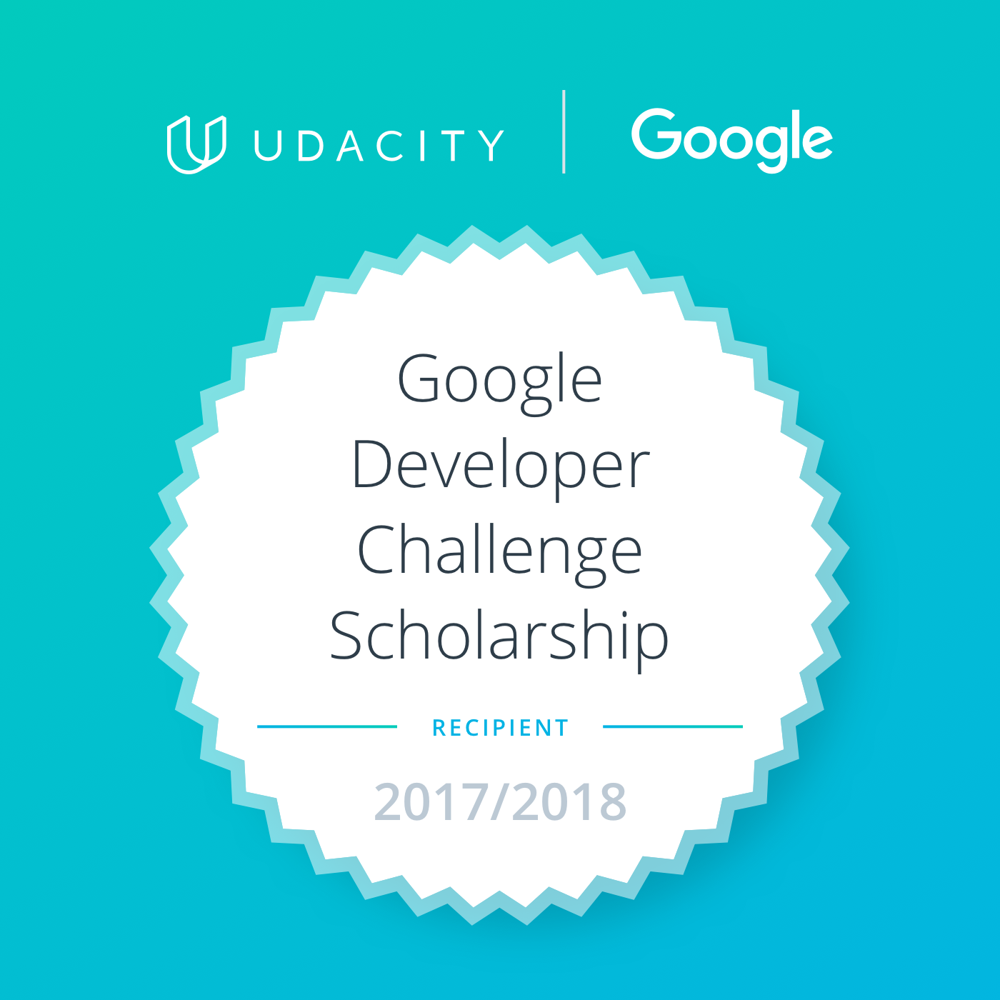

# Google Developer Challenge: Mobile Web Specialist

 
   <h3>Quiz discussions and answers</h3>

 
   
  
   

## Context
Udacity in association with Google selected students for a course about Offline Experience 
in Progressive Apps. The course includes ten lessons of different topics (see below) and 
quizzes are merged in (almost) each of the lessons.

 
<b>We do not support copy and paste.</b>
 
(Blocks of codes are commented out, please review) 

 

** This was created by the students of 2017/2018, however anyone (in any date) is welcome to contribute.

## Content
The discussions held by the students while 
solving each of the quizzes for all the lessons, besides the proper answers for each 
of the tasks. 

## Description
Each folder contains a **Readme** file with questions and answers about each 
of the quizzes. At the end of each **readme.md** is attached the formal answer for the quiz. 

- [x] - [Lesson 3: Service Workers](service_worker/)
- [x] - [Lesson 4: IndexedDB & Caching](indexedDB/)
- [x] - [Lesson 5: Javascript Syntax](javascript_syntax/)
- [x] - [Lesson 6: Functions](functions/)
- [x] - [Lesson 7: Built-ins](built_ins/)
- [x] - [Lesson 8: Professional Developer-fu](professional_developer_fu/)
- [x] - [Resources for the course](https://github.com/DomanskaGrzyb/awesome-google-mobile-web-challenge-links-2017)

## Message to contributors:
Please, if possible, use [Prettier](https://prettier.io/) before sending a pull request.

## License
You can drive. :blue_car: :car: 
